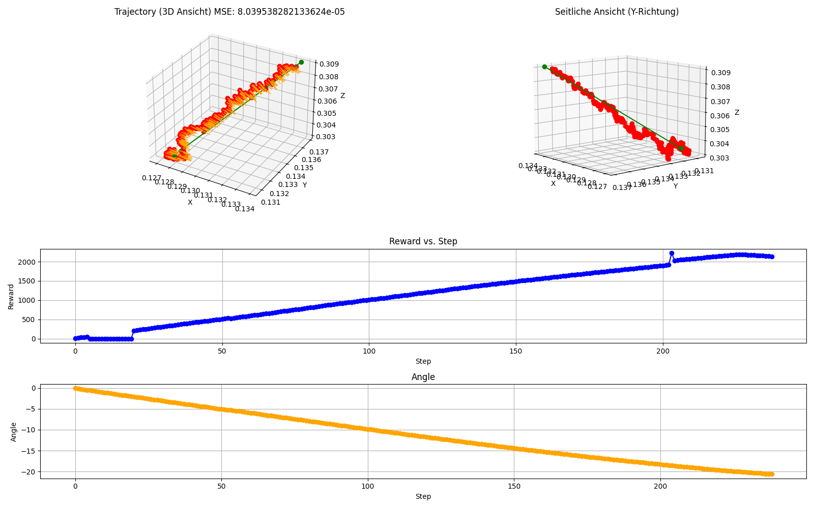
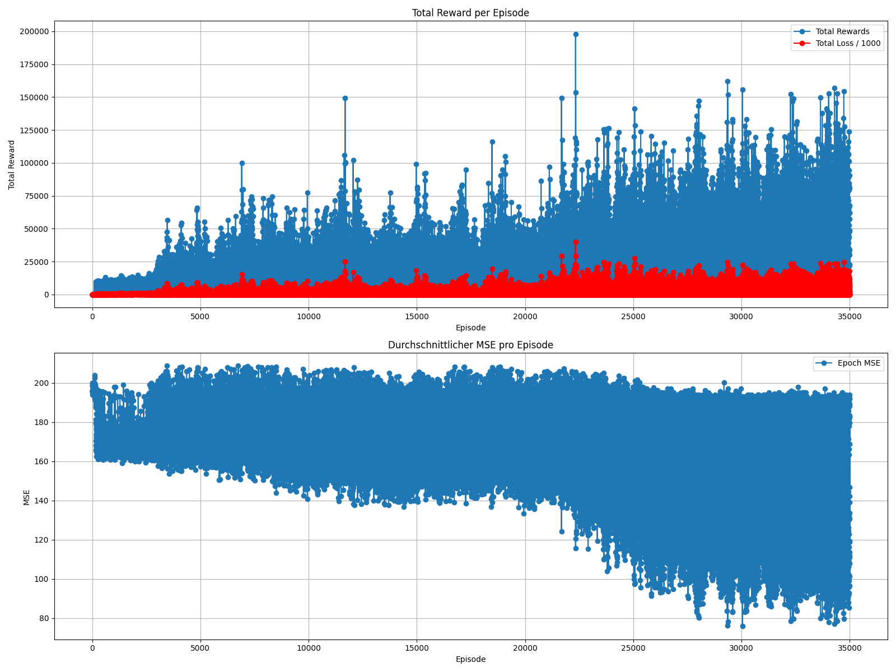

# 6-AxisRobot

<br />
This project uses Reinforcement Learning (RL) to teach a 6-Axis robot to follow a given trajectory and reach a requested angle. <br />
The RL approach uses function approximation with a Neural Network (NN) to learn the trajectory. <br />
The used REINFORCE algorithm is based on an implementation from "Foundations of Deep Reinforcement learning"  by L Graesser and W Keng.

<br />

# Content

- [RL Task](#Task)
- [Environment](#Environment)
- [REINFORCE Algorithm](#Algorithm)
- [Neural Net](#NeuralNet)
- [Reward](#Reward)
- [Results](#Results)
- [Future Work](#FutureWork)


## Task

The specific task being solved by this project is to drive on a 10mm long trajectory through 3D space, while fulfilling a 20 degree rotation of the TCP (Tool Center Point) in reference to the Z-axis. <br />
<br />


Another requirement was to use RL (Reinforcement Learning): function approximation with a Neural Network as an approach to solve the problem. <br />


## Environment

The environment was designed to be compatible with the openai [Gymnasium-API](https://gymnasium.farama.org/api/env/). <br />
It has a reset and a step function and contains the agent, which is the robotic arm. <br />


### Robot Arm

The agent in the environment is a robotic arm with 6 joints. It's kinematic properties are defined in the following Denavit-Hartenberg matix: <br />

| joint angle [deg] | link length [m] | link offset [m] | link twist [deg] |
| :------- | :------: | :-------: | -------: |
| theta1 | 0 | 0.15185 | 90 |
| theta2 | -0.24355 | 0 | 0 |
| theta3 | -0.2132  | 0 | 0 |
| theta4 | 0 | 0.13105 | 90 |
| theta5 | 0 | 0.08535 | -90 |
| theta6 | 0 | 0.0921 | 0 |
<br />

The agent receives an array with angles for the 6 joints, performas a forward kinematic and returns the X, Y and Z position in 3D space as well as the 3 euler angles for the orientation of the TCP.
The resulting orientation can be plotted like this with the plot-function within the RobotArm-class:

<p align="center">
  
</p>


### Step

As action the step-function expects an array of 6 angle-deltas usualy with values of 0.1, 0 and -0.1 to increase or decrease the joint angles of the robot arm. <br />
It then updates the agents state and checks, if the TCP is still within a defined observation-space. <br />
If the position exceeds the boundarys of the observation space, a reset is triggered. <br />
Otherwise it calculates and returns the reward for the updated state. <br />
Example:

<p align="center">
  
</p>


## Algorithm

### 1. REINFORCE (`train` Function)

The REINFORCE algorithm is a policy gradient method that updates the policy parameters using Monte Carlo estimates of the returns. It is implemented in the `train` function.

1. **Discounted Return Calculation:**
   - A backward loop computes the cumulative return (`rets`) for each time step by summing the current reward and the discounted future rewards.
   - This is done using a discount factor `gamma`.

```python
for t in reversed(range(T)):
    future_ret = pi.rewards[t] + gamma * future_ret
    rets[t] = future_ret
```

The following example illustrates the use of the discount factor gamma. It is used so that if an episode receives a high reward, the actions taken to reach that point are given greater weight, resulting in a more sophisticated learning process. The following table illustrates this relationship.

#### Episode Performance Overview

| Episode | Collected Rewards       | Discounted Returns                          | Calculated Loss           |
|---------|-------------------------|---------------------------------------------|---------------------------|
| 1       | `[1, 2, 30, 40, 100]`   | `[167.25456, 167.9339, 167.61, 139, 100]`    | `-370.90423095703125`      |
| 2       | `[1, 0.4, 1, 2, 5]`     | `[9.1196785, 8.201695, 7.8805, 6.95, 5]`      | `-18.580936794281005`      |
| 3       | `[1, 1, 1, 1, 100]`     | `[100, 100, 100, 100, 100]`                  | `-250.005`                |


2. **Tensor Conversion:**

- The computed returns and the recorded log probabilities (`pi.log_probs`) are converted into PyTorch tensors.

3. **Loss Calculation:**

- The policy gradient loss is computed as the negative sum of the product of log probabilities and discounted returns.
- This is done because `Gradient Descent` is used so the backpropagation wants to minimize the loss.
- An entropy bonus (`exp * total_entropy`) is subtracted to encourage exploration by penalizing overly deterministic policies. The exp-Paramter is set to `0.01`.

```python
loss = - (log_probs * rets).sum() - exp * total_entropy
```

4. **Backpropagation and Parameter Update:**

- Gradients are zeroed using `optimizer.zero_grad()`.
- The backward pass is performed with `loss.backward()`, and finally,
- The optimizer updates the model parameters with `optimizer.step()`.

```python
optimizer.zero_grad()
loss.backward()
optimizer.step()
```

##### Full Code Snippet

```python
def train(pi, optimizer):
    T = len(pi.rewards)
    rets = np.empty(T, dtype=np.float32)
    future_ret = 0.0
    for t in reversed(range(T)):
        future_ret = pi.rewards[t] + gamma * future_ret
        rets[t] = future_ret
    rets = torch.tensor(rets)
    log_probs = torch.stack(pi.log_probs)
    
    # Aggregate entropy over all time steps
    total_entropy = torch.stack(pi.agg_entropies).sum() if len(pi.agg_entropies) > 0 else 0

    # Compute loss using policy gradient and entropy bonus
    loss = - (log_probs * rets).sum() - exp * total_entropy

    optimizer.zero_grad()
    loss.backward()
    optimizer.step()
    return loss

```


### 2. Action Sampling (`act` Method)

The `act` method is responsible for selecting actions based on the network's output:

- **Process:**
  1. The input state is converted to a PyTorch tensor.
  2. The network computes logits for each joint, which are reshaped to `(num_joints, num_options)`.
  3. For each joint, a categorical distribution is created from the logits.
  4. An action is sampled from each distribution, and the corresponding log probability and entropy are recorded.
  5. The sampled action indices (0, 1, or 2) are mapped to concrete movement values (-0.1, 0.0, +0.1).

```python
def act(self, state):
    x = torch.from_numpy(np.array(state, dtype=np.float32))
    logits = self.forward(x)  # shape: (6, 3)
    actions = []
    log_prob_list = []
    entropy_list = []
    for i in range(self.num_joints):
        dist = Categorical(logits=logits[i])
        action_i = dist.sample()
        actions.append(action_i.item())
        log_prob_list.append(dist.log_prob(action_i))
        entropy_list.append(dist.entropy())
    total_log_prob = torch.stack(log_prob_list).sum()
    total_entropy = torch.stack(entropy_list).sum()
    self.log_probs.append(total_log_prob)
    self.agg_entropies.append(total_entropy)
    
    mapping = {0: -0.1, 1: 0.0, 2: 0.1}
    deltas = np.array([mapping[a] for a in actions])
    return deltas
```


## NeuralNet
This section describes the used Neural Net which will, after a successfull learning periode, represent the policy of the agent. It takes an input state (joint angles) and outputs the logits for the discrete action options for each joint.

**Parameters:**
- **`in_dim`**: Dimension of the input state (e.g., 6 joint angles).
- **`num_joints`**: Number of joints (default: 6).
- **`num_options`**: Number of discrete options per joint (default: 3, representing actions like -0.1, 0.0, +0.1).

**Architecture:**
- **Input Layer:**  
  A linear layer transforms the input from `in_dim` to 64 units.

- **Hidden Layers:**  
  1. ReLU activation followed by a linear layer mapping 64 to 128 units.  
  2. Another ReLU activation followed by a linear layer mapping 128 back to 64 units.  
  3. A final ReLU activation.

- **Output Layer:**  
  A linear layer maps from 64 units to `out_dim`, where `out_dim = num_joints * num_options` (e.g., 6 × 3 = 18).

**Additional Initialization:**
- `self.onpolicy_reset()`: Resets lists for storing log probabilities, rewards, and entropy values.
- `self.train()`: Sets the model to training mode.

## Code Snippet

```python
class Pi(nn.Module):
    def __init__(self, in_dim, num_joints=6, num_options=3):
        super(Pi, self).__init__()
        self.num_joints = num_joints
        self.num_options = num_options
        out_dim = num_joints * num_options  # 6 * 3 = 18

        self.model = nn.Sequential(
            nn.Linear(in_dim, 64),   # Input layer: in_dim -> 64
            nn.ReLU(),
            nn.Linear(64, 128),      # Hidden layer: 64 -> 128
            nn.ReLU(),
            nn.Linear(128, 64),      # Hidden layer: 128 -> 64
            nn.ReLU(),
            nn.Linear(64, out_dim)   # Output layer: 64 -> out_dim (num_joints * num_options)
        )
        
        self.onpolicy_reset()  # Initialize log probabilities, rewards, and entropies
        self.train()           # Set model to training mode

```


## Reward

1. **Collision**

In the beginning the movements of the agent often lead to the robot colliding with the walls of the observation space.
To punish this behavior, the function returns a greater negative reward and resets the environment.

```python
# Punish crashing onto wall
if self.checkBounds():
    reward = reward - 1000
```
<br />

2. **Finish reward**

The reward function separately rewards and punishes the translation and rotation of the robot.
When the desired position or angle is reached, the agent will be extra rewarded by a greater amount.
The decision, whether a goal is reachd is made by implementing tollerances around the desired states, which can be widened and narrowed. <br />
<br />

Assigning greate positive and negative rewards to the last step of an episode concerns all steps of the episode because of the "Discounted Return Calculation" discussed in the [Algorithm](#Algorithm)-section. Therefore the network favours all of the decisions that led to achieving the goal, not only the last one.

```python
# Translation Finish
tolerance = 0.0005
if np.linalg.norm(aktPos - finish) < tolerance:
    print("TCP reached Endpoint!")
    TRANS = True
    tmpReward = reward + 2000
    tmpReward = tmpReward - self.cntStep * 30
    
    if tmpReward < 300:
        reward = 300
    else:
        reward = tmpReward

    self.Terminated = True

# Rotation Finish
tolerance = 0.5
if (abs(finishANG - aktANG) < tolerance):
    ROT = True
    if not self.reachedAngle:
        print("Angle reached Endpoint!")
        ROT = True
        reward += 300
    else:
        reward += 100
```
<br />

3. **Incremental reward**
   
To incentivize the desired behavior and make the agent follow the trajectory, he is given a linear growing positive reward for proceeding along the trajectory.

```python
# Translation reward
v = finish - startPos
w = aktPos - startPos
t = np.dot(w, v) / np.dot(v, v)
t_clamped = np.clip(t, 0, 1)
reward = reward + t_clamped * 100
```
<br />

4. **Punish deviation**

When the agent is displacing from the trajectory a value grwing with the distance is subtracted from the reward.
The deviance of the current TCP angele from the desired angle is subtracted from the reward as well.

```python
# Punish for distancing from trajectory
projection = startPos + t_clamped * v
distance = np.linalg.norm(aktPos - projection)
reward = reward - distance * 100

# Rotation reward
if (reward > 0):
    difANG = 20 - abs(finishANG - aktANG)
    if difANG >0:
        reward += difANG * 100
```
<br />

5. **Goal achieved**

As a result the robot learns not to crash into a wall and  starts following the trajectory until it reaches the endpoint.
It also learns to change its TCP angle by the desired 20 deg.

```python
if TRANS and ROT:
    reward += 10000
    print("\nSuccess!!! Reached Endpoint & Angle")
```

The specific reward ammounts and tolerances were observed to have great impact on the performance of the agent.


## Results

After approximately 100.000 episodes of training the following results were obtained.
The robot follows the trajectory to the end point while achieving a smooth rotation of 20 degrees.


<p align="center">
  
</p>


The following animation shows the process of training over the 100.000 episodes.
One can observe that in the beginning the algorithm has many collision with the wall, but after some times learns the way onto the observation space and along the trjectory into the end point. When punishing to much for not following the trajectory close enough, the algorithm did not overcome the initial collisions. Punishing less lead to unsatisfying trajectories. So the values chosen in the reward function wehe a compromise between functionality and end-performance.


<p align="center">
  
</p>

<p align="center">
  
</p>
<br />


### Figures of merit
In order to present our figures of merit, we begin with a plot showing the cumulative reward, loss, and MSE computed over the epochs. In the figure below, you can see the outcome of a run in which the policy learns both to reach the TCP and to adjust its orientation. The MSE and the reward are self-explanatory. However, it is important to note that the loss in our approach should not be understood in the same way as, for example, the MSE in supervised learning. In supervised learning we expect the loss to shrink over time since backpropagation adjusts the parameters to reduce the error. Here, the observed increase in the loss may seem counterintuitive at first.

The reason for this behavior lies in the way the loss is computed. The loss is defined as:


```ini
loss = - (log_probs * returns).sum() - exp * total_entropy
```


Since the logarithm of a probability (which lies between 0 and 1) is always ≤ 0, the term log_probs * returns is negative for a good action (where log_probs is close to 0) and becomes even more negative for a bad action. The leading minus sign then converts these negative values into positive loss values. Hence, a bad action results in a much higher positive loss compared to a good action. The optimizer minimizes this loss via gradient descent, thereby indirectly maximizing the return.

The only reason the loss increases over time is that the cumulative reward grows as the policy improves, scaling the loss upward. However, this does not alter the optimization process: it is the direction of the gradient—not the absolute loss value—that guides the parameter updates. So, even if a well-performing policy yields a higher numerical loss due to larger returns, the gradients still point in the correct direction for further improvement. 

The loss function is defined as:

$$
L(\theta) = -\log\big(\pi(a \mid s; \theta)\big) \times R
$$

#### Gradient of the Loss

Using the chain rule, the gradient of the loss with respect to $$\theta$$ is given by:

$$
\nabla_\theta L = - R \cdot \nabla_\theta \log\big(\pi(a \mid s; \theta)\big)
$$


<p align="center">
  
</p>


#### Calculation of MSE

```python
def computeMSE(self, currentPos, currentAngle, startPos, finish, finishAngle, weight_angle=1.0):
    v = finish - startPos
    t = np.dot(currentPos - startPos, v) / np.dot(v, v)
    P_closest = startPos + t * v
    error_pos = currentPos - P_closest
    mse_pos = np.mean(error_pos ** 2)
    
    error_angle = currentAngle - finishAngle
    mse_angle = error_angle ** 2
    mse_total = (mse_pos + weight_angle * mse_angle) / 2.0  # Division durch 2 für Durchschnitt
    return mse_total
```


## FutureWork

To improve the algorithm in the future the idea of cirriculum learning should be introduced to update the tolerances and reward values.
In the beginning the tolerances should be wide, the positive finish and incremental reward should be high while the  negative reward for the distance and collision should be low to teach the agent to move in the desired direction. <br />
In later episodes where the  agent is finishing the translation and rotatioon task very often the tolerrances should get smaler and the negative rewards should be risen to train the agent to optimize the trajectory, while the finish and incremental rewards could be lowered to be less dominant. <br />
This way the algorithm should learn faster while achieving better results on following the trajectory.
