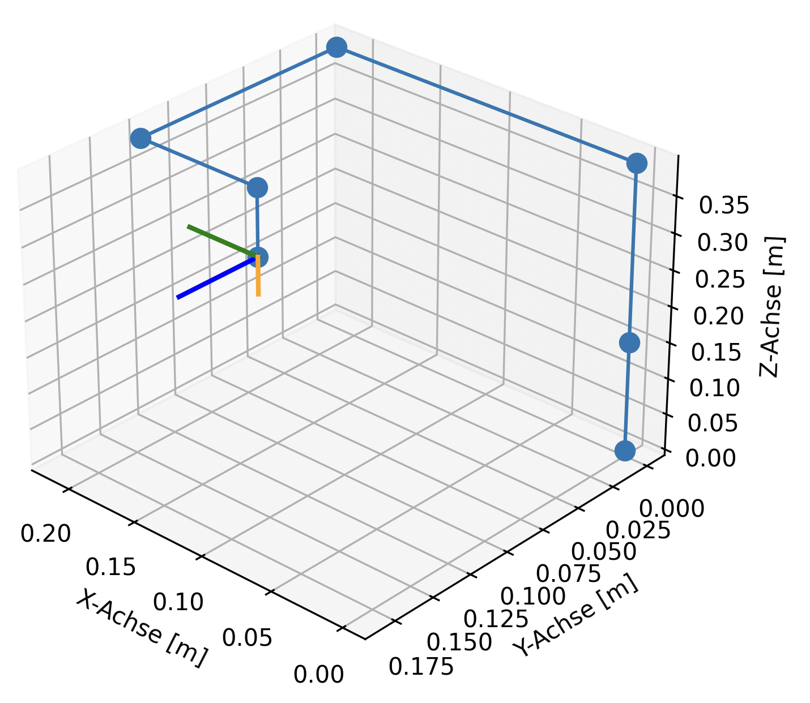
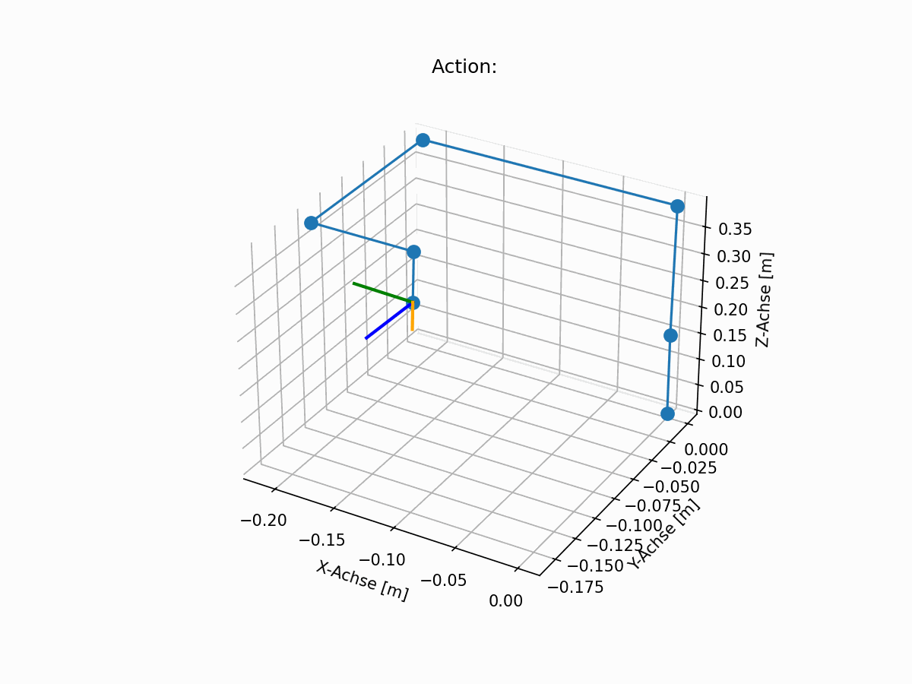

# 6-AxisRobot

<br />
This project uses Reinforcement Learning (RL) to teach a 6-Axis robot to drive on a given trajectory and reach a requested angle. <br />
The RL approach uses function approximation with a Neural Network (NN) to learn the trajectory. <br />
The used REINFORCE algorithm is based on an implementation from "Foundations of Deep Reinforcement learning"  by L Graesser and W Keng.

<br />

# Content

- [RL Task](#Task)
- [Environment](#Environment)
- [REINFORCE Algorithm](#Algorithm)
- [Neural Net](#NeuralNet)
- [Reward](#Reward)
- [Results](#Results)
- [Future Work](#FutureWork)


## Task

The specific task being solved by this project is to drive on a 10mm long trajectory through 3D space, while fulfilling a 20 degree rotation of the TCP (Tool Center Point) in reference to the Z-axis. <br />
<br />


Another requirement was to use RL (Reinforcement Learning): function approximation with a Neural Network as an approach to solve the problem. <br />


## Environment

The environment was designed to be compatible with the openai [Gymnasium-API](https://gymnasium.farama.org/api/env/). <br />
It has a reset and a step function and contains the agent, which is the robotic arm. <br />


### Robot Arm

The agent in the environment is a robotic arm with 6 joints. It's kinematic properties are defined in the following Denavit-Hartenberg matix: <br />

| joint angle [deg] | link length [m] | link offset [m] | link twist [deg] |
| :------- | :------: | :-------: | -------: |
| theta1 | 0 | 0.15185 | 90 |
| theta2 | -0.24355 | 0 | 0 |
| theta3 | -0.2132  | 0 | 0 |
| theta4 | 0 | 0.13105 | 90 |
| theta5 | 0 | 0.08535 | -90 |
| theta6 | 0 | 0.0921 | 0 |
<br />

The agent receives an array with angles for the 6 joints, performas a forward kinematic and returns the X, Y and Z position in 3D space as well as the 3 euler angles for the orientation of the TCP.
The resulting orientation can be plotted like this with the plot-function within the RobotArm-class:

<p align="center">
  
</p>


### Step

As action the step-function expects an array of 6 angle-deltas usualy with values of 0.1, 0 and -0.1 to increase or decrease the joint angles of the robot arm. <br />
It then updates the agents state and checks, if the TCP is still within a defined observation-space. <br />
If the position exceeds the boundarys of the observation space, a reset is triggered. <br />
Otherwise it calculates and returns the reward for the updated state. <br />
Example:

<p align="center">
  
</p>

### Trajectory


## Algorithm

The used algorithm is REINFORCE.

## NeuralNet
This section describes the used Neural Net which will, after a successfull learning periode, represent the policy of the agent. It takes an input state (joint angles) and outputs the logits for the discrete action options for each joint.

**Parameters:**
- **`in_dim`**: Dimension of the input state (e.g., 6 joint angles).
- **`num_joints`**: Number of joints (default: 6).
- **`num_options`**: Number of discrete options per joint (default: 3, representing actions like -0.1, 0.0, +0.1).

**Architecture:**
- **Input Layer:**  
  A linear layer transforms the input from `in_dim` to 64 units.

- **Hidden Layers:**  
  1. ReLU activation followed by a linear layer mapping 64 to 128 units.  
  2. Another ReLU activation followed by a linear layer mapping 128 back to 64 units.  
  3. A final ReLU activation.

- **Output Layer:**  
  A linear layer maps from 64 units to `out_dim`, where `out_dim = num_joints * num_options` (e.g., 6 × 3 = 18).

**Additional Initialization:**
- `self.onpolicy_reset()`: Resets lists for storing log probabilities, rewards, and entropy values.
- `self.train()`: Sets the model to training mode.

## Code Snippet

```python
class Pi(nn.Module):
    def __init__(self, in_dim, num_joints=6, num_options=3):
        super(Pi, self).__init__()
        self.num_joints = num_joints
        self.num_options = num_options
        out_dim = num_joints * num_options  # 6 * 3 = 18

        self.model = nn.Sequential(
            nn.Linear(in_dim, 64),   # Input layer: in_dim -> 64
            nn.ReLU(),
            nn.Linear(64, 128),      # Hidden layer: 64 -> 128
            nn.ReLU(),
            nn.Linear(128, 64),      # Hidden layer: 128 -> 64
            nn.ReLU(),
            nn.Linear(64, out_dim)   # Output layer: 64 -> out_dim (num_joints * num_options)
        )
        
        self.onpolicy_reset()  # Initialize log probabilities, rewards, and entropies
        self.train()           # Set model to training mode

```


## Reward

In the beginning the movements of the agent often lead to the robot colliding with the walls of the observation space.
To punish this behavior, the function returns a greater negative reward and resets the environment.

The reward function separately rewards and punishes the translation and rotation of the robot.
When the desired position or angle is reached, the agent will be extra rewarded by a greater amount.
The decision, whether a goal is reachd is made by implementing tollerances around the desired states, which can be widened and narrowed.

To incentivize the desired behavior and make the agent follow the trajectory, he is given a linear growing positive reward for proceeding along the trajectory.

When the agent is displacing from the trajectory a value grwing with the distance is subtracted from the reward.
The deviance of the current TCP angele from the desired angle is subtracted from the reward as well.

As a result the robot learns not to crash into a wall and  starts following the trajectory until it reaches the endpoint.
It also learns to change its TCP angle by the desired 20 deg.

The specific reward ammounts and tolerances were observed to have great impact on the performance of the agent.


## Results


## FutureWork

<p align="center">
  
</p>

gamma1 = 0.99
gamma2 = 0.70
